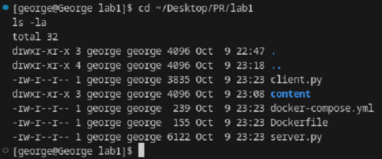
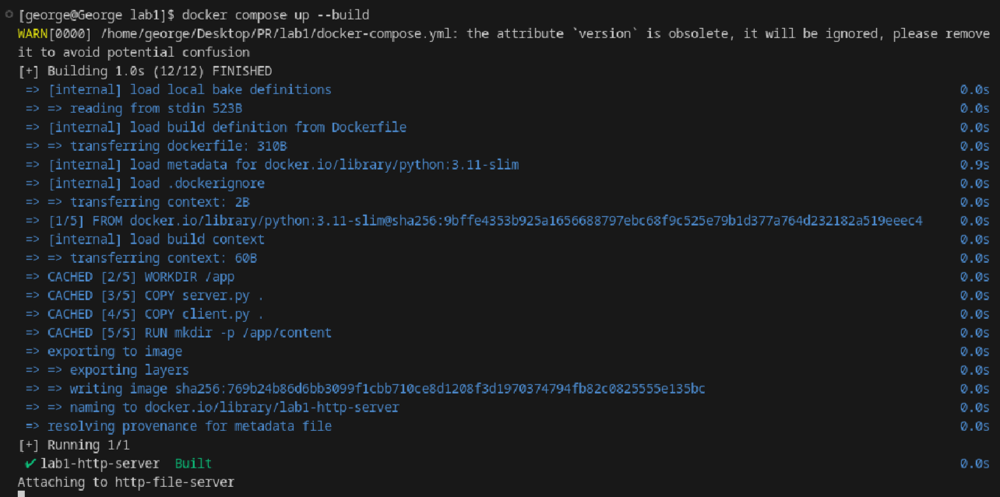
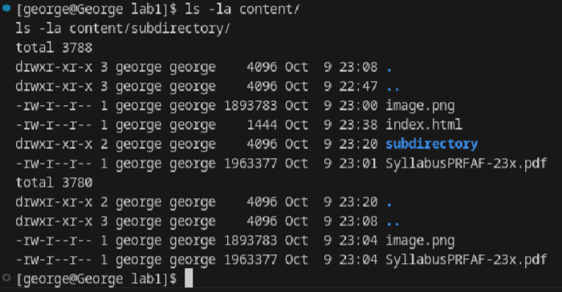
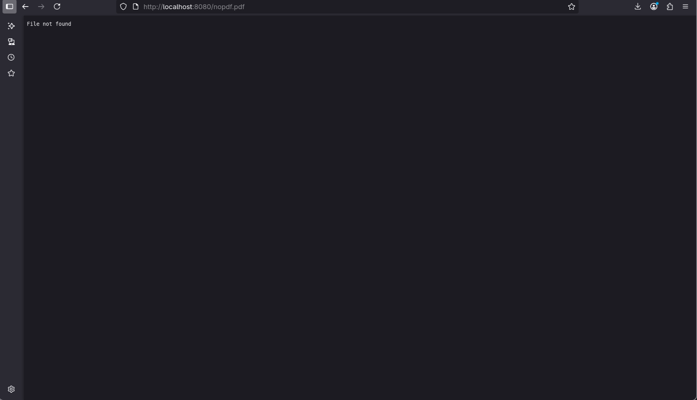
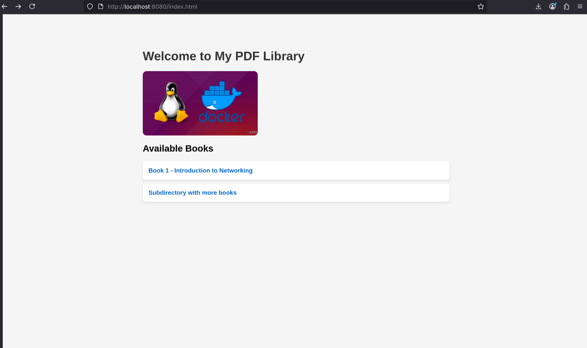
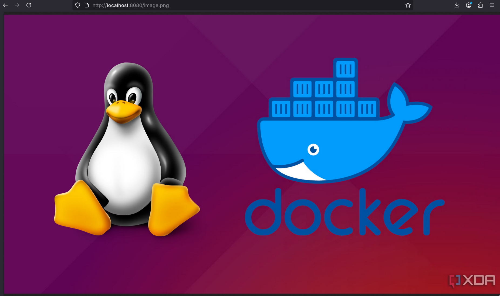
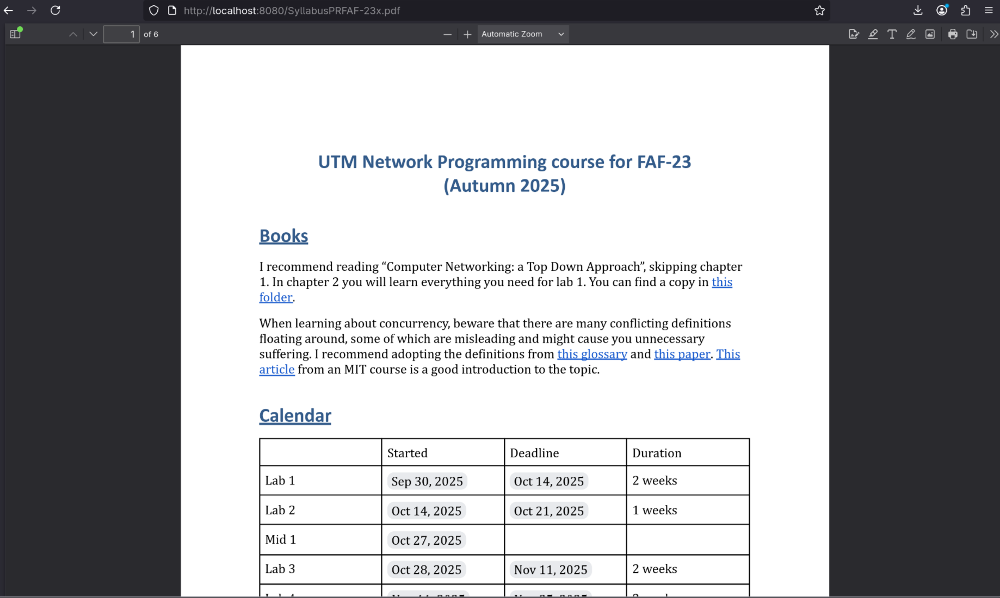
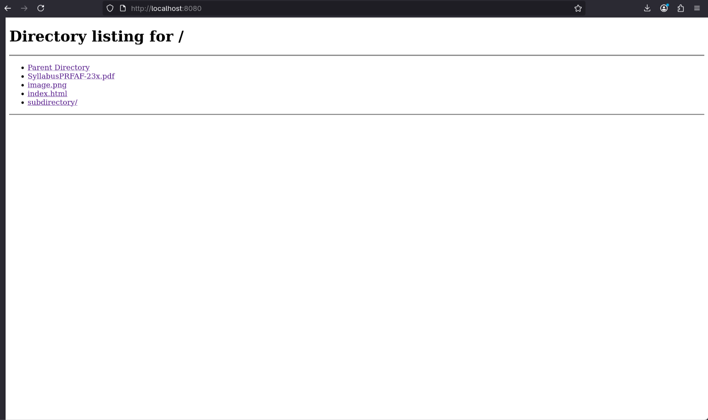
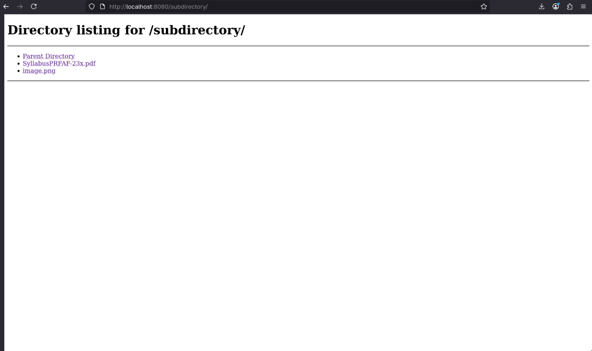
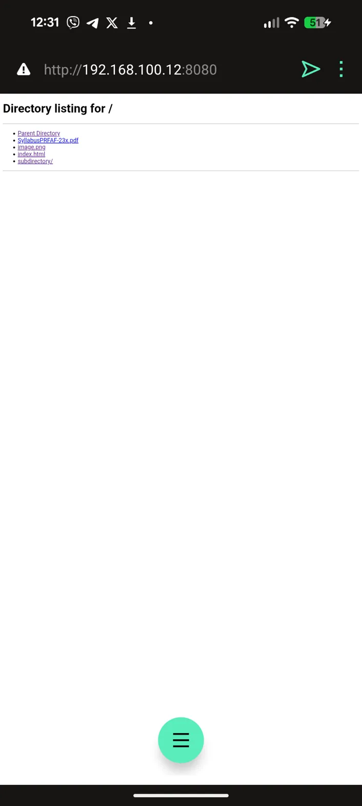

# HTTP File Server Lab Report

## Student Information

* **Name:** George
* **Lab:** HTTP File Server Implementation
* **Date:** October 9, 2025

---

## Overview

This lab implements a simple HTTP file server in Python that serves HTML, PNG, and PDF files. The server is containerized using Docker and includes an HTTP client for downloading files. The server supports directory listing for browsing nested directories.

---

## 1. Project Structure

### Command:

```bash
cd ~/Desktop/PR/lab1
ls -la
```

### Output:

```
total 32
drwxr-xr-x 3 george george 4096 Oct  9 22:47 .
drwxr-xr-x 4 george george 4096 Oct  9 23:18 ..
-rw-r--r-- 1 george george 3835 Oct  9 23:23 client.py
drwxr-xr-x 3 george george 4096 Oct  9 23:08 content
-rw-r--r-- 1 george george  239 Oct  9 23:23 docker-compose.yml
-rw-r--r-- 1 george george  155 Oct  9 23:23 Dockerfile
-rw-r--r-- 1 george george 6122 Oct  9 23:23 server.py
```



*Figure 1: Complete project structure with all required files*

---

## 2. Docker Configuration

### 2.1 Dockerfile

#### Command:

```bash
cat Dockerfile
```

#### Content:

```dockerfile
FROM python:3.11-slim

WORKDIR /app

COPY server.py .
COPY client.py .

RUN mkdir -p /app/content

EXPOSE 8080

CMD ["python", "server.py", "/app/content"]
```

### 2.2 Docker Compose Configuration

#### Command:

```bash
cat docker-compose.yml
```

#### Content:

```yaml
version: '3.8'

services:
  http-server:
    build: .
    container_name: http-file-server
    ports:
      - "8080:8080"
    volumes:
      - ./content:/app/content:ro
    command: python server.py /app/content
    restart: unless-stopped
```



*Figure 2: Docker Compose configuration file*

---

## 3. Content Directory

### Commands:

```bash
ls -la content/
ls -la content/subdirectory/
```

### Output:

```
content/:
total 3788
drwxr-xr-x 3 george george    4096 Oct  9 23:08 .
drwxr-xr-x 3 george george    4096 Oct  9 22:47 ..
-rw-r--r-- 1 george george 1893783 Oct  9 23:00 image.png
-rw-r--r-- 1 george george    1444 Oct  9 23:38 index.html
drwxr-xr-x 2 george george    4096 Oct  9 23:20 subdirectory
-rw-r--r-- 1 george george 1963377 Oct  9 23:01 SyllabusPRFAF-23x.pdf

subdirectory/:
total 3780
drwxr-xr-x 2 george george    4096 Oct  9 23:20 .
drwxr-xr-x 3 george george    4096 Oct  9 23:08 ..
-rw-r--r-- 1 george george 1893783 Oct  9 23:04 image.png
-rw-r--r-- 1 george george 1963377 Oct  9 23:04 SyllabusPRFAF-23x.pdf
```



*Figure 3: Content directory with HTML, PNG, PDF files and a subdirectory*

---

## 4. Starting the Server

### 4.1 Building Docker Container

#### Command:

```bash
docker compose up --build
```

#### Output:

```
WARN[0000] /home/george/Desktop/PR/lab1/docker-compose.yml: the attribute version is obsolete
[+] Building 1.2s (12/12) FINISHED
 => [internal] load build definition from Dockerfile                                0.0s
 => [internal] load metadata for docker.io/library/python:3.11-slim                1.1s
 => [1/5] FROM docker.io/library/python:3.11-slim                                   0.0s
 => CACHED [2/5] WORKDIR /app                                                       0.0s
 => CACHED [3/5] COPY server.py .                                                   0.0s
 => CACHED [4/5] COPY client.py .                                                   0.0s
 => CACHED [5/5] RUN mkdir -p /app/content                                          0.0s
 => exporting to image                                                              0.0s
[+] Running 1/1
 ✔ lab1-http-server  Built                                                          0.0s
Attaching to http-file-server
```

*Figure 4: Docker building the image and starting the container*

### 4.2 Container Status

#### Command:

```bash
docker ps
```

#### Output:

```
CONTAINER ID   IMAGE              COMMAND                  CREATED             STATUS         PORTS                                         NAMES
e80cfaa84257   lab1-http-server   "python server.py /a…"   About an hour ago   Up 4 minutes   0.0.0.0:8080->8080/tcp, [::]:8080->8080/tcp   http-file-server
```

*Figure 5: Container running successfully with port mapping*

### 4.3 Server Logs

#### Command:

```bash
docker logs http-file-server
```

#### Output:

```
Server started on port 8080
Serving directory: /app/content
Press Ctrl+C to stop

Connection from ('172.18.0.1', 32854)
Received request:
GET /index.html HTTP/1.1
Host: localhost:8080
User-Agent: Mozilla/5.0 (X11; Linux x86_64; rv:140.0) Gecko/20100101 Firefox/140.0
Parsed: method=GET, path=/index.html
Looking for file: /app/content/index.html
Is directory: False
Is file: True
200 OK - Served: /app/content/index.html (text/html)

Connection from ('172.18.0.1', 32870)
Received request:
GET /image.png HTTP/1.1
Parsed: method=GET, path=/image.png
Looking for file: /app/content/image.png
Is directory: False
Is file: True
200 OK - Served: /app/content/image.png (image/png)

Connection from ('172.18.0.1', 32880)
Received request:
GET /SyllabusPRFAF-23x.pdf HTTP/1.1
Parsed: method=GET, path=/SyllabusPRFAF-23x.pdf
Looking for file: /app/content/SyllabusPRFAF-23x.pdf
Is directory: False
Is file: True
200 OK - Served: /app/content/SyllabusPRFAF-23x.pdf (application/pdf)

Connection from ('172.18.0.1', 32894)
Received request:
GET /nopdf.pdf HTTP/1.1
Parsed: method=GET, path=/nopdf.pdf
Looking for file: /app/content/nopdf.pdf
Is directory: False
Is file: False
404 - File not found: /app/content/nopdf.pdf
```

*Figure 6: Server logs showing successful file serving and 404 error handling*

**Note:** Some `BrokenPipeError` messages may appear in logs when browsers close connections prematurely. These are expected and handled gracefully by the server.

---

## 5. Browser Testing

### 5.1 404 Error Test

**URL:**`http://localhost:8080/nonexistent.pdf`

**Expected Result:** HTTP 404 Not Found error

**Server Log:**

```
404 - File not found: /app/content/nonexistent.pdf
```



*Figure 7: Browser displays "File not found" message*

---

### 5.2 HTML File Test

**URL:**`http://localhost:8080/index.html`

**Expected Result:** HTML page displays with embedded PNG image

**Server Log:**

```
200 OK - Served: /app/content/index.html (text/html)
200 OK - Served: /app/content/image.png (image/png)
```



*Figure 8: HTML page rendering correctly with embedded image*

---

### 5.3 PNG Image Test

**URL:**`http://localhost:8080/image.png`

**Expected Result:** PNG image displays in browser

**Server Log:**

```
200 OK - Served: /app/content/image.png (image/png)
```



*Figure 9: PNG image renders directly in the browser*

---

### 5.4 PDF File Test

**URL:**`http://localhost:8080/SyllabusPRFAF-23x.pdf`

**Expected Result:** PDF opens in browser or downloads

**Server Log:**

```
200 OK - Served: /app/content/SyllabusPRFAF-23x.pdf (application/pdf)
```



*Figure 10: PDF file successfully opened in browser*

---

### 5.5 Root Directory Listing Test

**URL:**`http://localhost:8080/`

**Expected Result:** Generated HTML page showing directory contents with hyperlinks

**Directory Listing Contents:**

* Parent Directory
* SyllabusPRFAF-23x.pdf
* image.png
* index.html
* subdirectory/

**Server Log:**

```
Parsed: method=GET, path=/
Looking for file: /app/content
Is directory: True
```



*Figure 11: Directory listing with clickable links to all files and subdirectories*

---

### 5.6 Subdirectory Listing Test

**URL:**`http://localhost:8080/subdirectory/`

**Expected Result:** Generated HTML page showing subdirectory contents

**Server Log:**

```
Parsed: method=GET, path=/subdirectory/
Looking for file: /app/content/subdirectory
Is directory: True
```



*Figure 12: Subdirectory listing showing nested files*

---

## 6. HTTP Client Implementation

### 6.1 Client Commands

```bash
cd ~/Desktop/PR/lab1
mkdir -p downloads

python client.py localhost 8080 /index.html downloads
python client.py localhost 8080 /SyllabusPRFAF-23x.pdf downloads
python client.py localhost 8080 /image.png downloads
python client.py localhost 8080 / downloads
```

### 6.2 Client Output

#### Test 1: Download HTML

```
Requesting: http://localhost:8080/index.html
Status Code: 200
Content-Type: text/html
Content-Length: 1444

HTML Content:
--------------------------------------------------------------------------------
<!DOCTYPE html>
<html lang="en">
<head>
    <meta charset="UTF-8">
    <meta name="viewport" content="width=device-width, initial-scale=1.0">
    <title>My PDF Collection</title>
    <style>
        body {
            font-family: Arial, sans-serif;
            max-width: 800px;
            margin: 50px auto;
            padding: 20px;
            background-color: #f5f5f5;
        }
        h1 {
            color: #333;
        }
        .book-list {
            list-style-type: none;
            padding: 0;
        }
        .book-list li {
            background: white;
            margin: 10px 0;
            padding: 15px;
            border-radius: 5px;
            box-shadow: 0 2px 5px rgba(0,0,0,0.1);
        }
        .book-list a {
            color: #0066cc;
            text-decoration: none;
            font-weight: bold;
        }
        .book-list a:hover {
            text-decoration: underline;
        }
        img {
            max-width: 300px;
            display: block;
            margin: 20px 0;
            border-radius: 10px;
        }
    </style>
</head>
<body>
    <h1>Welcome to My PDF Library</h1>
  
    
  
    <h2>Available Books</h2>
    <ul class="book-list">
        <li><a href="SyllabusPRFAF-23x.pdf">Book 1 - Introduction to Networking</a></li>
        <li><a href="subdirectory/">Subdirectory with more books</a></li>
    </ul>
</body>
</html>
--------------------------------------------------------------------------------
```

#### Test 2: Download PDF

```
Requesting: http://localhost:8080/SyllabusPRFAF-23x.pdf
Status Code: 200
Content-Type: application/pdf
Content-Length: 1963377

File saved to: downloads/SyllabusPRFAF-23x.pdf
File size: 1963377 bytes
```

#### Test 3: Download PNG

```
Requesting: http://localhost:8080/image.png
Status Code: 200
Content-Type: image/png
Content-Length: 1893783

File saved to: downloads/image.png
File size: 1893783 bytes
```

#### Test 4: Directory Listing

```
Requesting: http://localhost:8080/
Status Code: 200
Content-Type: text/html
Content-Length: 444

HTML Content:
--------------------------------------------------------------------------------
<!DOCTYPE html>
<html>
<head>
    <title>Directory listing for /</title>
</head>
<body>
    <h1>Directory listing for /</h1>
    <hr>
    <ul>
        <li><a href="../">Parent Directory</a></li>
        <li><a href="/SyllabusPRFAF-23x.pdf">SyllabusPRFAF-23x.pdf</a></li>
        <li><a href="/image.png">image.png</a></li>
        <li><a href="/index.html">index.html</a></li>
        <li><a href="/subdirectory/">subdirectory/</a></li>
    </ul>
    <hr>
</body>
</html>
--------------------------------------------------------------------------------
```

*Figure 13: Client successfully downloading and displaying files*

### 6.3 Downloaded Files

#### Command:

```bash
ls -lh downloads/
```

#### Output:

```
total 3.7M
-rw-r--r-- 1 george george 1.9M Oct  9 23:59 image.png
-rw-r--r-- 1 george george 1.9M Oct 10 00:34 SyllabusPRFAF-23x.pdf
```

*Figure 14: Files successfully downloaded by the client*

---

## 7. Network Testing

### 7.1 Network Setup

#### Finding Local IP Address:

```bash
ip addr show | grep inet
```

#### Output:

```
inet 127.0.0.1/8 scope host lo
inet6 ::1/128 scope host noprefixroute 
inet 172.17.0.1/16 brd 172.17.255.255 scope global docker0
inet6 fe80::707e:c0ff:fea4:e08e/64 scope link proto kernel_ll 
inet 192.168.x.x/24 brd 192.168.100.255 scope global dynamic noprefixroute wlan0
inet6 fe80::75c9:2efe:ad72:7970/64 scope link noprefixroute 
inet 172.18.0.1/16 brd 172.18.255.255 scope global br-5bf7e5206726
inet6 fe80::1c3d:2cff:fe2c:90cd/64 scope link proto kernel_ll
```

**Network Configuration:**

* **Server IP:** 192.168.x.x (local network)
* **Network Interface:** wlan0 (WiFi)
* **Client Device:** Pixel 8 (Android 16)
* **Client IP:** 192.168.x.y (same local network)

*Figure 15: Network configuration showing server IP address*

### 7.2 Mobile Device Access

**URL Accessed:**`http://192.168.x.x:8080/index.html`


*Figure 16: Mobile phone successfully accessing the HTTP server showing index.html*



*Figure 17: Mobile phone showing directory listing*

#### Server Logs:

```bash
docker logs http-file-server | grep "192.168"
```

#### Output:

```
Connection from ('192.168.x.y', 34872)
Connection from ('192.168.x.y', 34876)
Connection from ('192.168.x.y', 50518)
Connection from ('192.168.x.y', 50528)
Connection from ('192.168.x.y', 50540)
Connection from ('192.168.x.y', 50544)
```

*Figure 18: Server logs showing multiple connections from mobile device on the same local network*

**Result:** Successfully accessed the HTTP server from a mobile device on the same local network, demonstrating proper network configuration and cross-device compatibility.

---

## 8. Technical Implementation Details

### Server Features (server.py)

* Socket-based HTTP/1.1 server implementation
* Supports GET requests only (405 for other methods)
* MIME type detection for HTML, PNG, and PDF files
* Dynamic directory listing generation with HTML links
* Security: Path normalization to prevent directory traversal attacks
* Proper HTTP response headers (Content-Type, Content-Length)
* Comprehensive error handling:
  * 404 Not Found - File doesn't exist
  * 403 Forbidden - Path outside served directory
  * 415 Unsupported Media Type - Unknown file extension
  * 500 Internal Server Error - Server-side errors

### Client Features (client.py)

* HTTP GET request implementation using raw sockets
* HTTP response parsing (status line, headers, body)
* Content-type based handling:
  * text/html: Print to console
  * image/png: Save to disk
  * application/pdf: Save to disk
* Command-line argument parsing (host, port, path, directory)
* Error handling for connection failures and invalid responses
* File extension detection from path or Content-Type header

### Docker Configuration

* **Base Image:** python:3.11-slim (lightweight Python environment)
* **Port Mapping:** 8080:8080 (host:container)
* **Volume Mount:** ./content:/app/content:ro (read-only for security)
* **Working Directory:** /app
* **Restart Policy:** unless-stopped (automatic recovery)
* **Network:** Bridge mode allowing both localhost and LAN access

---

## Conclusion

This lab successfully implements a functional HTTP file server with all required features:

### Core Server Functionality

* HTTP server correctly handles GET requests and rejects other methods
* Serves HTML, PNG, and PDF files with proper MIME types and Content-Length headers
* Returns appropriate 404 errors for non-existent files
* Accepts directory as command-line argument for flexible content serving
* Fully containerized with Docker and docker-compose for portability and isolation

### HTTP Client

* Command-line client successfully implemented using raw socket programming
* Downloads and saves binary files (PNG, PDF) correctly
* Prints HTML content to console for immediate viewing
* Handles different content types appropriately based on HTTP headers

### Directory Listing

* Generates valid HTML pages for directory browsing
* Displays clickable hyperlinks for easy navigation
* Supports nested subdirectories with proper path handling
* Includes parent directory link for navigation

### Network Testing

* Successfully accessed from mobile device on the same local network
* Server handled requests from external device on local network
* Cross-device compatibility verified with different user agents
* Proper logging of remote connections

The server demonstrates proper HTTP/1.1 protocol implementation, handles multiple file types correctly with appropriate MIME types, and provides a user-friendly interface for browsing files through generated directory listings. All functionality has been thoroughly tested and verified through browser access, programmatic client access, and cross-device network testing.

The implementation follows best practices including security measures (path normalization), proper error handling, and clean separation of concerns between server and client code.
